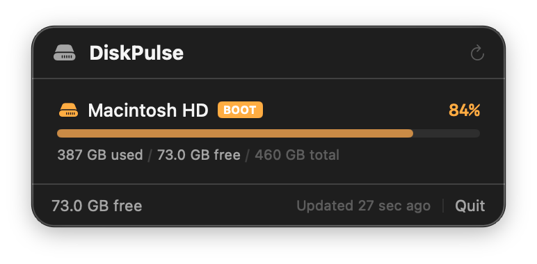

# DiskPulse

Per-volume disk space monitor in your macOS menu bar. Shows usage percentage, color-coded bars, and free space at a glance.



## Why

Disk space is buried in Finder status bars or System Settings. Developers lose space silently to node_modules, Docker images, Xcode derived data, and build caches. DiskPulse keeps your boot volume usage visible at all times and shows all mounted volumes in a clean popup.

## Features

- Menu bar shows boot volume usage % with drive icon
- Popup lists all mounted volumes with usage bars
- Color-coded: green (<75%), orange (75-90%), red (90%+)
- Per-volume details: used / free / total
- Volume categories: Boot, Internal, External, Network
- Hover to see mount point path
- Click any volume to open in Finder
- Auto-refresh every 30 seconds + manual refresh button
- Uses APFS "important usage" capacity for accurate free space
- Background-only (no dock icon)

## Install

**Using the build script (recommended):**

```bash
cd DiskPulse
chmod +x build.sh
./build.sh
open DiskPulse.app
```

**Or compile manually:**

```bash
cd DiskPulse
swiftc -parse-as-library -o DiskPulse DiskPulse.swift
./DiskPulse
```

**Or build a .app bundle manually (no dock icon):**

```bash
cd DiskPulse
swiftc -parse-as-library -o DiskPulse DiskPulse.swift
mkdir -p DiskPulse.app/Contents/MacOS
cp DiskPulse DiskPulse.app/Contents/MacOS/
cp Info.plist DiskPulse.app/Contents/
open DiskPulse.app
```

## Quickstart

1. Build and launch: `swiftc -parse-as-library -o DiskPulse DiskPulse.swift && ./DiskPulse`
2. Look for the drive icon + percentage in your menu bar
3. Click to see all volumes with usage bars
4. Orange = 75-90% used, Red = 90%+ (time to clean up)
5. Click any volume row to open it in Finder

## Examples

**Glance at boot volume usage:**
The menu bar shows a drive icon and percentage like "67%". Green means plenty of space. Orange (75-90%) means it is time to audit. Red (90%+) means clean up now.

**Check all volumes at once:**
Click the menu bar icon to see every mounted volume with a colored usage bar, used/free/total breakdown, and volume category (Boot, Internal, External, Network).

**Open a volume in Finder:**
Click any volume row in the popup to open that volume directly in Finder. Useful for quickly navigating to an external drive or network share.

**Spot an external drive filling up:**
Plug in an external SSD. DiskPulse picks it up on the next 30-second refresh (or click Refresh). The popup shows it under "External" with its own usage bar so you can see at a glance whether there is room for a Time Machine backup or file transfer.

**Compare purgeable vs. real free space:**
DiskPulse uses the APFS "important usage" capacity API, which accounts for purgeable space (caches macOS can reclaim). This is why DiskPulse may report more free space than `df` -- it reflects what macOS will actually make available.

## Testing

DiskPulse has no automated test suite (single-file SwiftUI app). Verify correctness manually:

1. **Compile check** -- `swiftc -parse-as-library -o DiskPulse DiskPulse.swift` should complete with zero errors and zero warnings.
2. **Launch check** -- run `./DiskPulse` or `open DiskPulse.app`. A drive icon with a percentage should appear in the menu bar within a few seconds.
3. **Popup check** -- click the menu bar icon. All mounted non-hidden volumes should appear with colored usage bars.
4. **Color coding** -- verify green bars for volumes under 75%, orange for 75-90%, red for 90%+.
5. **Click-to-open** -- click a volume row. Finder should open to that volume's mount point.
6. **Refresh** -- click the Refresh button. The scan timestamp at the bottom should update.
7. **External volume** -- plug in a USB drive or mount a network share, then refresh. The new volume should appear.
8. **Background-only** -- verify no dock icon appears. On macOS, run: `osascript -e 'tell application "System Events" to get name of every process whose background only is true'` and confirm DiskPulse is in the list.

## Troubleshooting

- **No icon in menu bar** — macOS may hide it if the bar is full. Try closing other menu bar apps.
- **Percentage seems wrong** — DiskPulse uses APFS "important usage" capacity which accounts for purgeable space. This is more accurate than `df`.
- **External drives not showing** — Only non-hidden volumes are listed. Time Machine and system snapshots are filtered out.

## Requirements

- macOS 14.0+ (Sonoma or later)
- Swift 6.0+ compiler

## License

MIT
